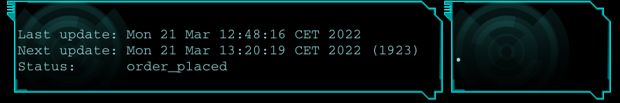
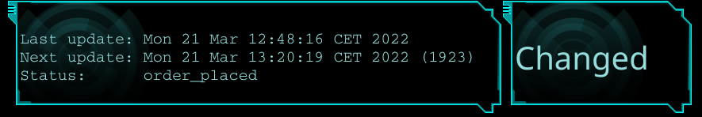
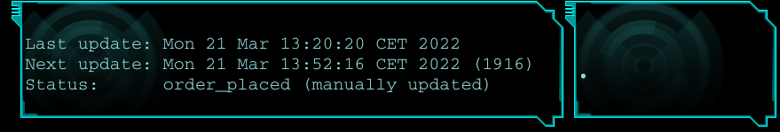

# ksandom's IGG order status

* Runs in a loop periodically checking with a large (~30 minutes by default), random interval.
* Can be run manually to get output sooner. Eg there's a frenzy in the discord chat about peoples' orders being locked.
* Status can be displayed in a widget on your desktop. Eg

Here we are getting the result we expect:



This is what it looks like when it has changed from what we were expecting.



This is what it looks like when you've done an extra manual check.




## Installation

1. Edit `iggStatus`, and insert your [curl command](../../README.md).
1. Copy the `igg*` scripts to somewhere in your path. Eg
    ```bash
    mkdir -p ~/bin;cp igg* ~/bin
    ```
    If you didn't already have ~/bin, you may need to log and and back in again for it to work. Distributions like Ubuntu will detect it and add it to your path. On other distributions, you may need to do a little more work.
1. Set up a widget in your desktop to run `cat ~/Documents/iggStatus` occasionally. I have mine set to check every 10 seconds. There is no call to the Indiegogo API with this command, so you can run it often.
1. Set up another widget in your desktop to run `iggChanged` . I have this configured to run every minute on my machine. This also doesn't make an API call, so it is safe to run often.


## Running it

### Normal flow

1. Execute `iggStatusLoop` . As long as this is running, then 

### Manually do an extra check in the normal flow

Do this only when you want to get an extra update from normal.

1. Leave the `iggStatusLoop` that you already started running.
1. Execute `iggManualUpdate` .

### Once-off

1. Execute `iggStatus` .

## Acknowledging a change

1. Execute `iggAck` .

## Tuning timing

You can change how often it checks against indiegogo by editing these two lines in `iggStatusLoop`.

```bash
BASE_DELAY=1500 # Keep this large.
MAX_RANDOM_DELAY=600 # This is an additional random delay so that it looks less like a bot.
```

## Widgets for specific desktop environments

### KDE Plasma

* "[Command Output](https://store.kde.org/p/1166510/)" is available from the KDE store.
